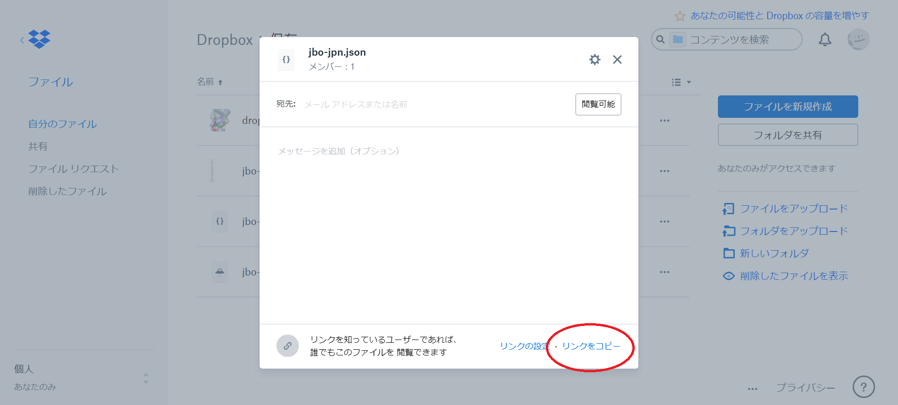

# amuhiku

[https://amuhiku.netlify.com/](https://amuhiku.netlify.com/)

## 概要

辞書を作成・編集・閲覧するための Web アプリです。ブラウザ上で動くので、スマホでも扱えます。むしろ PC よりもスマホでの操作性を重視しています。

## 報告など

不具合の報告や新機能の提案などを受け付けています。Twitter で @kepeken に@ツイートを送るか、ハッシュタグ #amuhiku をつけてつぶやいてください。

## 更新履歴

amuhiku は Web アプリという形態上、バージョン番号をつけていません（ローリングリリース）。具体的な機能追加や変更に関しては Twitter #amuhiku でつぶやいていきます。

## 辞書データについて

OTM-JSON というデータ形式を採用しています。

http://ja.conlinguistics.wikia.com/wiki/OTM-JSON

## 対応ブラウザ

### スマホ
- iOS Safari 10~
- Android Chrome

### PC
- Chrome
- Firefox ?
- Edge ?
- Safari 10~

## 非対応ブラウザ

### スマホ
- iOS Safari ~9
- Android Browser

### PC
- Internet Explorer

## 辞書を公開するには

### GitHub レポジトリや Gist にある辞書

- https://github.com/ から、データとして使いたい JSON ファイルのあるページを開きます。
- **Raw** **Blame** **History** などと並んでいるところの **Raw** を押します。ファイルサイズが大きい場合は中央に **View Raw** などど表示されているのでそれを押します。
- https://raw.githubusercontent.com/ で始まる URL にリダイレクトされるので、URL をコピーします。

### Dropbox にある辞書

- データとして使いたい JSON ファイルの共有リンクを作ります。
- 共有リンクは `https://www.dropbox.com/s/【ID的なやつ】/【ファイル名】?dl=0` という形式になっていると思いますが、これを `https://dl.dropboxusercontent.com/s/【ID的なやつ】/【ファイル名】` に変更します。これをコピーしておきます。
- （面倒くさいですね。そのうち対処を考えます。）

### コピーしたら

- amuhiku を開きます。
- **Open** から **URL を指定して読み込む** を開き、コピーした URL を入力します。
- 成功すれば amuhiku が公開用の URL に切り替わります。
